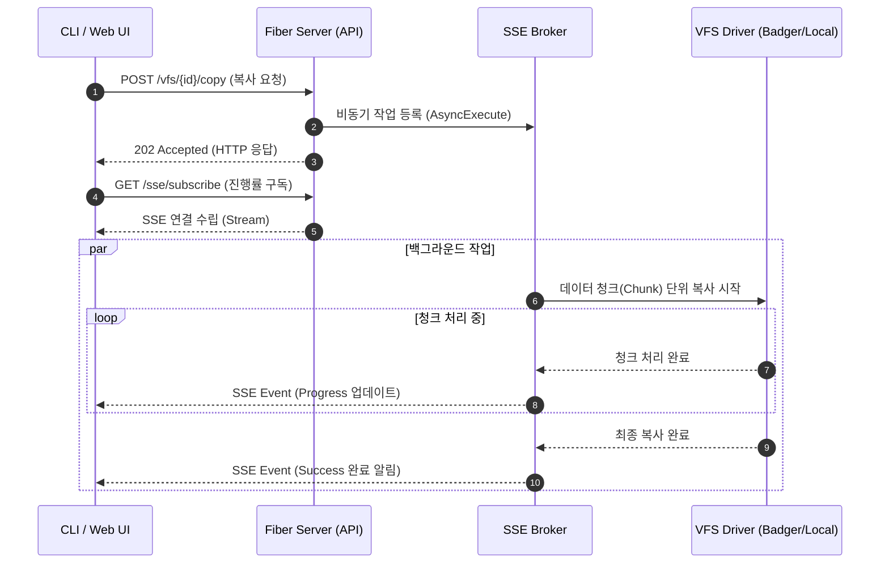
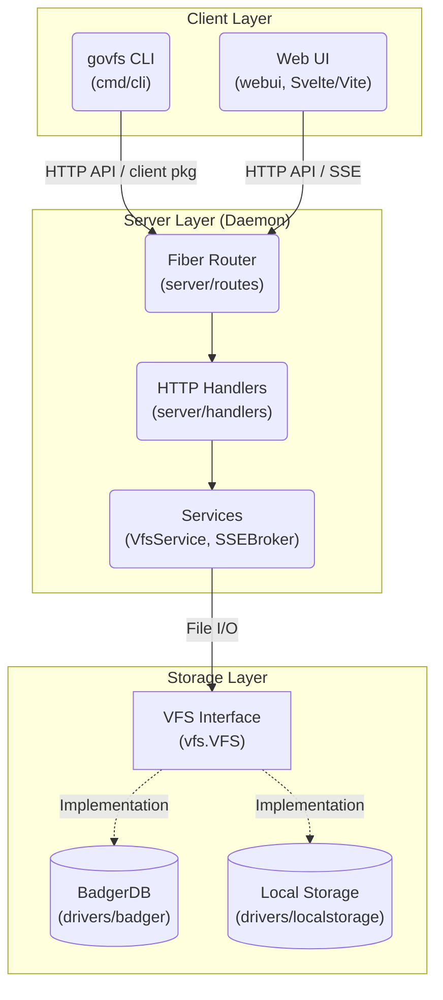

# govfs 프로젝트 디자인 문서

## 1. 프로젝트 개요

**govfs**는 Go 언어로 작성된 가상 파일 시스템(Virtual File System) 프로젝트입니다. BadgerDB 기반 저장소와 로컬 파일 시스템 드라이버를 지원하며, 웹 서버, 웹 UI 및 CLI를 통해 파일을 관리합니다.

## 2. 프로젝트 구조

```text
/
├── bootstrap/         # 애플리케이션 초기화 로직 (VFS, Server)
├── cli/               # CLI 명령어 구현체 (secret, vfs)
│   ├── secret/        # Secret 관리 관련 명령어
│   └── vfs/           # VFS 조작 명령어
├── client/            # govfs 서버와 통신하기 위한 API 클라이언트
├── internal/cloud/    # 외부에 연결되지 않은 클라우드 모듈
├── cmd/               # 메인 진입점
│   ├── cli/           # CLI 애플리케이션 (main.go)
│   └── server/        # 웹 서버 애플리케이션 (main.go)
├── config/            # 설정 로직 (Viper, TOML)
├── data/              # 로컬 데이터 저장소 (BadgerDB 등 기본 경로)
├── docs/              # Swagger API 문서
├── drivers/           # VFS 스토리지 드라이버 인터페이스 및 구현체
│   ├── badger/        # BadgerDB (Key-Value) 드라이버
│   ├── localstorage/  # LocalStorage (Native FS) 드라이버
│   └── driver.go      # 드라이버 팩토리 및 공통 인터페이스
├── scripts/           # 유틸리티 및 배포 쉘 스크립트
├── server/            # 웹 서버 및 API 라우팅 로직
│   ├── handlers/      # HTTP 핸들러 (VFS, SSE)
│   ├── middlewares/   # 미들웨어 (Logger, CORS 등)
│   ├── routes/        # 라우터 설정 (Web, API)
│   ├── services/      # 비즈니스 로직 (VFS Service, SSE Broker)
│   └── types/         # API 요청/응답 타입 정의
├── tools/             # 개발 및 데이터 마이그레이션 도구
├── vfs.go             # VFS 인터페이스 및 코어 타입 (Meta, File, TreeNode)
├── webui/             # Svelte 5 + Vite 기반 웹 프론트엔드
├── go.mod             # Go 모듈 의존성 관리
├── Dockerfile         # Docker 이미지 빌드 설정
└── Makefile           # 빌드 및 유틸리티 스크립트 실행
```

## 3. 기능 리스트 및 요약

- **가상 파일 시스템 (VFS)**
  - **Core Interface**: `vfs.VFS` 인터페이스를 통한 표준화된 파일 작업.
  - **Pluggable Drivers**: `config.toml` 설정을 통해 스토리지 백엔드 교체 가능 (`badger`, `localstorage`).
  - **Meta Handling**: 파일 메타데이터(크기, 수정 시간, MIME 타입 등) 자동 관리.
- **사용자 격리**
  - 관리자와 일반 사용자 역할을 제공한다.
  - 계정은 시스템 BadgerDB에 저장한다.
  - 각 사용자는 UUID 경로의 독립된 BadgerDB 드라이브를 사용한다.
  - 관리자는 다른 사용자의 파일에 접근할 수 없다.
  - 관리자는 파일 식별자나 요청 내용을 포함하지 않는 최근 사용자 변경 이벤트를 조회할 수 있다.
  - 이벤트는 페이지 단위로 전체 또는 사용자별 조회하며 정리가 필요할 때 사용자 단위로만 전체 삭제한다.
  - 관리자 상태 화면은 시스템 DB 집계와 활성화된 Fiber 진단 API를 표시하고, 사용자 드라이브 통계는 선택한 사용자 상세에서만 조회한다.
  - 시스템 DB 상세는 페이지 조회만 제공하며 사용자 비밀번호 해시와 알 수 없는 raw value는 노출하지 않는다.
  - 사용자 온라인 상태는 현재 SSE 연결 유무로 판단하며 Badger 드라이브 open 상태와 별도로 표시한다.
- **웹 서버 (API)**
  - **Framework**: `gofiber/fiber` v3 기반의 고성능 웹 서버.
  - **API Endpoints**:
    - `POST /vfs`: 파일/디렉토리 생성
    - `GET /vfs`: 파일 목록 조회 (List/Tree 뷰 지원)
    - `GET /vfs/:id`: 파일 다운로드 및 스트리밍 (Range Request 지원)
    - `PUT /vfs/:id`: 파일 내용 수정
    - `PATCH /vfs/:id`: 파일/디렉토리 이동(Rename)
    - `DELETE /vfs/:id`: 파일/디렉토리 삭제
    - `POST /vfs/:id/copy`: 파일 복사
    - `PATCH /vfs/:id/comments`: 파일 코멘트 수정
    - **Maintenance**: `backup`, `restore`, `rotate` (암호화 키)
  - **SSE (Real-time)**:
    - `GET /sse/subscribe`: 실시간 이벤트 구독
    - `POST /sse/publish`: 이벤트 발행 (내부/외부 트리거)
    - **Async Operations**: 대용량 작업(Copy, Write 등)의 비동기 처리 및 진행 상황 알림.
- **웹 UI**
  - **Stack**: Svelte 5, Vite, TailwindCSS.
  - **Integration**: `server`가 정적 파일을 서빙하며 API와 연동.
- **CLI (Command Line Interface)**
  - **Framework**: `cobra`, `viper` 기반.
  - **Commands**:
    - `govfs [command]`: VFS 조작 및 관리 명령어 (Root Level)
      - `backup`, `restore`: 데이터 백업 및 복원
      - `rotate`: 암호화 키 교체
      - `ls`, `tree`, `stat`: 파일 조회
      - `cp`, `mkdir`, `rm`: 파일/디렉토리 조작
    - `govfs secret [command]`: Secret 관리 명령어
      - `set`, `get`: 키/값 기반 시크릿 설정 및 조회

### 3.1 주요 동작 시퀀스 (Operation Sequence)

다음은 CLI 또는 Web UI에서 비동기 파일 조작(예: 복사)을 요청하고, SSE를 통해 실시간으로 작업 진행 상황을 응답받는 대표적인 기능 흐름 시퀀스 다이어그램입니다.



## 4. 아키텍처 상세 (Architecture Details)



### 4.1 클라이언트-서버 모델 (Client-Server Model)

**govfs**는 클라이언트-서버 아키텍처를 채택했습니다. 사용자는 CLI(Client)를 통해 명령을 내리고, 실제 파일 시스템 조작은 백그라운드에서 실행 중인 서버(Daemon)가 수행합니다.

- **Daemon (Server)**:
  - **역할**: 실제 스토리지(BadgerDB, LocalStorage)에 접근하여 I/O를 수행하고 상태를 관리합니다.
  - **통신**: HTTP REST API 및 SSE(Server-Sent Events)를 통해 클라이언트와 통신합니다.
- **CLI (Client)**:
  - **역할**: 사용자 명령을 파싱하여 서버 API를 호출하고 결과를 출력합니다.
  - **특징**: 무상태(Stateless)이며, 로컬 설정 파일이나 환경 변수를 통해 서버 연결 정보를 참조합니다.

### 4.2 드라이버 추상화 (Driver Abstraction)

`vfs.VFS` 인터페이스는 파일 시스템의 모든 동작을 추상화합니다. `drivers.New(config)` 팩토리 함수를 통해 설정에 맞는 구현체를 주입받습니다.

`internal/cloud`에는 향후 연동을 위한 구현이 남아 있지만 서버 API, API 클라이언트, CLI 및 설정에는 연결되지 않는다.

### 4.3 사용자 드라이브

인증 미들웨어는 JWT의 사용자 UUID를 현재 사용자 레코드와 대조한다. `DriveManager`는 해당 UUID의 BadgerDB를 지연 생성하여 VFS 요청에 주입한다. 사용자 관리 API는 관리자 역할에만 열리지만 파일 API는 역할과 관계없이 현재 사용자의 드라이브만 선택한다.

### 4.3 스토리지 엔진 (Storage Engines)

| 특징 | BadgerDB Driver | LocalStorage Driver |
| :--- | :--- | :--- |
| **Path** | `drivers/badger` | `drivers/localstorage` |
| **Backend** | BadgerDB (LSM Tree Key-Value Store) | Native OS Filesystem (`os`, `io` 패키지) |
| **Data Model** | Key: UUID / Value: Metadata + Content | File System Path |
| **Pros** | **Single File**: 운반 용이성.<br>**Encryption**: 데이터 암호화 내장.<br>**Transaction**:  ACID 보장. | **Performance**: OS 커널 캐시 활용.<br>**Accessibility**: 파일 직접 열람 가능.<br>**Debug**: 디버깅 용이. |
