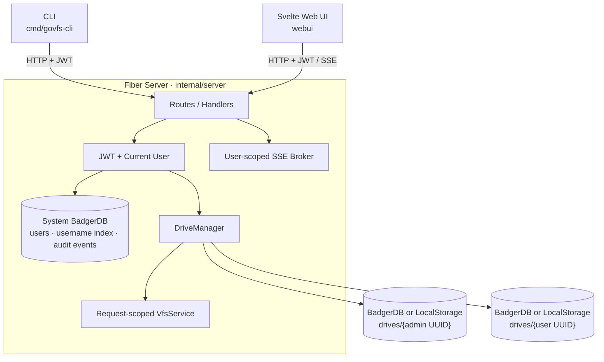

# govfs 디자인 문서

## Architecture Overview

govfs는 Fiber 기반 서버, Svelte 웹 UI, HTTP CLI로 구성된 다중 사용자 가상
파일 시스템이다. 서버는 인증된 사용자마다 선택된 VFS 드라이버를 지연 생성하며,
파일 API와 SSE 이벤트를 사용자 UUID 범위로 격리한다.



서버 시작 흐름은 `cmd/govfs/main.go` → `internal/config.LoadWithViper` →
`internal/server.Init` 순서다. `Init`은 시스템 사용자 DB와 최초 관리자를 준비하고
`DriveManager`를 생성한 뒤 라우트와 종료 훅을 등록한다
(`internal/server/init.go`).

## Component/Module Details

```text
/
├── cmd/
│   ├── server/              # 서버 진입점과 설정 파일 선택
│   └── cli/                 # CLI 진입점
├── internal/
│   ├── cli/                 # login, MCP, secret, VFS 명령
│   ├── client/              # 서버 HTTP API 클라이언트
│   ├── cloud/               # 현재 서버에 연결되지 않은 클라우드 코드
│   ├── config/              # Viper 설정 로딩·경로 확장·설정 타입
│   ├── mcp/                 # CLI 세션을 사용하는 MCP 서버
│   ├── server/
│   │   ├── handlers/        # auth, admin, VFS, SSE, Badger HTTP 처리
│   │   ├── middlewares/     # JWT, 현재 사용자, 감사, Fiber 미들웨어
│   │   └── services/        # 사용자 저장소, DriveManager, VFS, SSE
│   └── types/               # API 요청·응답 타입
├── pkg/
│   ├── drivers/
│   │   ├── badger/          # 암호화·트랜잭션 기반 VFS
│   │   └── localstorage/    # OS 파일 시스템 기반 VFS
│   └── log/                 # VFS 로거
├── docs/                    # OpenAPI 산출물과 기능 문서
├── tools/                   # Badger 마이그레이션·테스트 데이터 도구
├── webui/                   # 내장 Svelte 5 웹 UI
├── vfs.go                   # VFS 인터페이스와 핵심 타입
└── config.toml              # 배포용 서버 설정 예시
```

### Configuration

서버는 `-config`가 없으면 `~/.govfs/config.toml`을 읽는다
(`cmd/govfs/main.go`). Viper는 점을 밑줄로 바꾼 대문자 환경 변수로 설정을
덮어쓸 수 있다. `~`로 시작하는 로그와 드라이버 경로는 사용자 홈으로 확장된다
(`internal/config/viper.go`).

핵심 설정은 다음과 같다.

- `server.auth.admin`: 시스템 DB가 비었을 때만 사용하는 최초 관리자 자격 증명
- `server.auth.jwt`: JWT 서명 secret과 access token 만료 시간
- `server.fiber.bodyLimit`: HTTP 요청 본문 최대 크기
- `server.middlewares`: 관리자용 진단 endpoint 활성화 여부
- `server.webui.enabled`: 내장 웹 UI 제공 여부
- `vfs.driver.badger.path`: 사용자 드라이브 루트
- `vfs.driver.localstorage.path`: LocalStorage 사용자 드라이브 루트
- `gcInterval`, `gcDiscardRatio`: 모든 사용자 BadgerDB에 공통 적용되는 GC 설정

선택한 드라이버의 `path`가 `~/.govfs/drives`이면 시스템 DB는
`~/.govfs/system/users`, 사용자 드라이브는 `~/.govfs/drives/{UUID}`에 열린다
(`internal/server/init.go`, `internal/server/services/drives.go`).

### Authentication and User Isolation

시스템 BadgerDB는 사용자 레코드, 정규화된 사용자 이름 index, 최소 정보의 감사
이벤트를 저장한다 (`internal/server/services/users.go`). 시스템 DB가 비어 있으면
`server.auth.admin`으로 최초 관리자를 생성하며, 자격 증명이 없으면 서버 시작을
거부한다.

로그인은 bcrypt로 비밀번호를 확인하고 사용자 UUID를 JWT subject에 기록한다.
인증 요청마다 JWT 검증 뒤 시스템 DB에서 현재 사용자를 다시 조회하므로 계정
비활성화와 역할 변경이 기존 token에도 즉시 적용된다
(`internal/server/middlewares/auth.go`).

VFS와 Badger 라우트는 URL에서 사용자 ID를 받지 않는다. `withVFS`와
`withBadger`가 인증 컨텍스트의 UUID로 드라이브를 선택하므로 관리자도 다른
사용자의 파일 드라이브에 접근하지 못한다 (`internal/server/init.go`).

### Storage Lifecycle

`DriveManager`는 최초 요청 시 선택한 드라이버의 `path/{user UUID}`를 열고 서버
종료까지 재사용한다. 동시 최초 접근과 드라이브 map은 mutex로 보호한다. 서버
종료 훅은 열린 사용자 드라이브, 시스템 DB, 서버 로그를 닫는다
(`internal/server/services/drives.go`, `internal/server/init.go`).

서버는 `vfs.driver.type`에 따라 `drivers.New`로 BadgerDB 또는 LocalStorage를
생성한다. 시스템 사용자 DB는 파일 드라이버 선택과 관계없이 BadgerDB를 사용한다.
관리자 드라이브 사용량은 공통 `VFS.Tree` 결과의 item 수와 논리 크기로 계산한다.

### HTTP and SSE

라우트 구성의 source of truth는 `internal/server/init.go`다.

- `/auth`: 로그인, 로그아웃, 현재 사용자, 비밀번호 변경
- `/admin`: 사용자 관리, 시스템/드라이브 상태, 감사 이벤트
- `/vfs`: 생성, 조회, 수정, 이동, 복사, 삭제, backup/restore
- `/badger`: Badger 사용자의 key 진단, 통계, 암호화 키 회전
- `/sse`: 사용자별 구독자, 발행, client 목록

SSE broker는 서버 단위 객체 하나를 사용하지만 client와 message를 사용자 ID로
범위화한다. 파일 변경 이벤트와 client 목록은 다른 사용자에게 전달되지 않는다
(`internal/server/services/sse.go`, `internal/server/handlers/sse.go`).

### CLI Session

CLI는 `govfs login`에서 서버 URL, 사용자 이름, 비밀번호를 입력받아 즉시
`/auth/login`을 호출한다. 성공하면 서버 URL, 사용자 이름, access token, 만료
시각만 mode `0600`의 `~/.govfs/config`에 저장한다. 비밀번호는 저장하지 않는다
(`internal/cli/root.go`). Token이 없거나 만료되면 다른 명령은 `govfs login`을
안내한다.

## Implementation vs Design

- `/badger/*`와 CLI `rotate`는 Badger 전용이며 LocalStorage에서는 지원하지 않는다.
- `internal/cloud`는 보존돼 있지만 서버 API, CLI, 설정과 연결되지 않는다.
- 사용자 드라이브는 유휴 상태에서도 자동으로 닫히지 않는다. 열린 드라이브 수가
  리소스 문제가 될 때 eviction 정책이 필요하다.
- Read/Seek 벤치마크는 동일 파일을 반복하므로 warm-cache 성능을 주로 측정한다.
  상세 조건은 `BENCHMARK.md`를 따른다.
- `server.auth.jwt.secret`이 비어 있으면 실행 시 임의 값이 생성돼 재시작 후 기존
  token이 무효화된다. 운영 환경은 반드시 고정 secret을 제공해야 한다.
- 시스템 DB 경로는 드라이브 루트의 형제 `system/users`로 파생되며 별도 설정할
  수 없다.

## Updated Date

- 분석일: 2026-08-27
- 기준 커밋: `64256d2`
- Source of truth: `cmd/govfs/main.go`, `internal/config/`,
  `internal/server/`, `internal/cli/root.go`, `pkg/drivers/`
